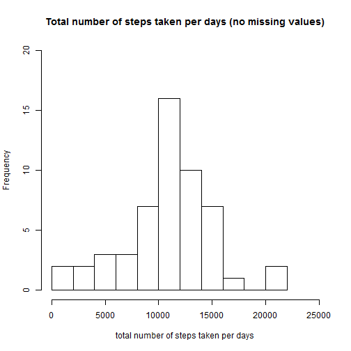
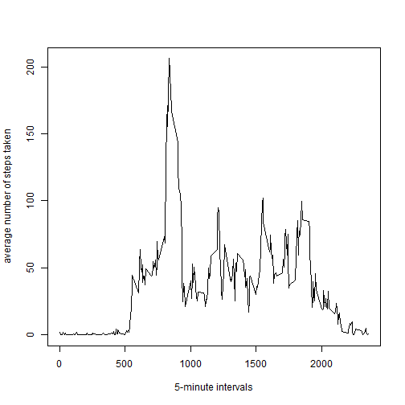
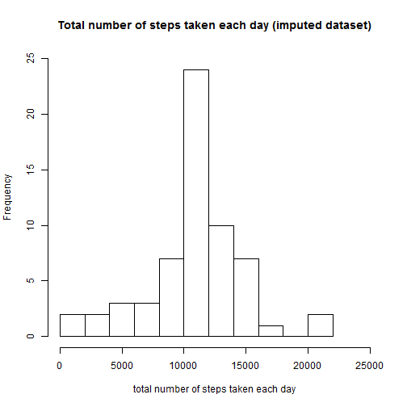

# Reproducible Research: Peer Assessment 1

This assignment makes use of data from a personal activity monitoring device such as a [Fitbit](http://www.fitbit.com/), [Nike Fuelband](http://www.nike.com/us/en_us/c/nikeplus-fuelband), or [Jawbone Up](https://jawbone.com/up).  
This device collects data at 5 minute intervals through out the day.  
The data consists of two months of data from an anonymous individual collected during the months of October and November, 2012 and include the number of steps taken in 5 minute intervals each day.


## Loading and preprocessing the data


```r
filename <- "activity.csv"
dataset <- read.csv(filename, colClasses=c('numeric', 'Date', 'numeric'))
```

## What is mean total number of steps taken per day?

Ignore the missing values in the dataset


```r
dataset.good <- dataset[complete.cases(dataset),]
```

Plot the histogram of the total number of steps taken per day


```r
steps.per.day <- tapply(dataset.good$steps, dataset.good$date, sum)
hist(steps.per.day, 
     breaks=10,
     xlim = c(0,25000),
     ylim = c(0,20),
     xlab='total number of steps taken per days', 
     main='Total number of steps taken per days (no missing values)')
```

 

Calculate and report the mean and median total number of steps taken per day


```r
mean(steps.per.day)
```

```
## [1] 10766
```


```r
median(steps.per.day)
```

```
## [1] 10765
```

## What is the average daily activity pattern?

Make a time series plot of the average number of steps taken every 5-minute interval, averaged across all days


```r
library(plyr)
group.by.interval <- ddply(dataset.good, .(interval), summarize, meansteps=mean(steps))

with(group.by.interval, {
  plot(interval, meansteps,  
       xlab='5-minute intervals',  
       ylab='average number of steps taken',  
       type = "l")
})
```

 

Which 5-minute interval, on average across all the days in the dataset, contains the maximum number of steps?


```r
max.meansteps <- max(group.by.interval$meansteps)
max.interval <- group.by.interval$interval[group.by.interval$meansteps==max.meansteps]
```

On average across all the days in the dataset, the 835-th 5-minute interval contains the maximum number of steps (206.1698).

## Imputing missing values

Calculate and report the total number of missing values in the dataset


```r
sum(!complete.cases(dataset))
```

```
## [1] 2304
```

Devise a strategy for filling in all of the missing values in the dataset.

I used the mean number of steps for the 5-minute intervals to fill the missing values, as follows:

*first I computed the mean number of steps for all the 5-minute intervals


```r
split.by.interval <- split(dataset.good$steps, dataset.good$interval)
meansteps.per.interval <- lapply(split.by.interval, mean)

meansteps.per.interval <- data.frame(
  interval=names(meansteps.per.interval), 
  steps=matrix(unlist(meansteps.per.interval)) )
```

*second I fill the missing values with the mean number of steps computed above


```r
dataset.bad <- dataset[!complete.cases(dataset),]

dataset.merged <- merge(dataset.bad, meansteps.per.interval,
                        by.x='interval',
                        by.y='interval',
                        all=F)

dataset.merged <- dataset.merged[, c('steps.y', 'date', 'interval')]
names(dataset.merged) <- c('steps', 'date', 'interval')
```

Create a new dataset that is equal to the original dataset but with the missing data filled in


```r
dataset.imputed <- rbind(dataset.good, dataset.merged)
dataset.imputed <- dataset.imputed[order(dataset.imputed$date, dataset.imputed$interval),]
```

Make an histogram of the total number of steps taken each day.


```r
steps.per.day.imputed <- tapply(dataset.imputed$steps, dataset.imputed$date, sum)

hist(steps.per.day.imputed,
     breaks=10,
     xlim = c(0,25000),
     ylim = c(0,25),
     main="Total number of steps taken each day (imputed dataset)",
     xlab="total number of steps taken each day")
```

 

Calculate and report the mean and median total number of steps taken per day


```r
mean(steps.per.day.imputed)
```

```
## [1] 10766
```


```r
median(steps.per.day.imputed)
```

```
## [1] 10766
```

Do these values differ from the estimates from the first part of the assignment?

Having filled the missing values with the mean number of steps over the 5-minute intervals, the mean remained unchanged. On the other hand the median is slightly increased.

What is the impact of imputing missing data on the estimates of the total daily number of steps?

Of course the total daily number of steps is increased after having inputed the dataset.

## Are there differences in activity patterns between weekdays and weekends?

Create a new factor variable in the dataset with two levels - "weekday" and "weekend" indicating whether a given date is a weekday or weekend day


```r
dataset.imputed$day <- weekdays(dataset.imputed$date)
dataset.imputed$day <- sapply(dataset.imputed$day, 
                            function(x) { if(x=='Saturday' || x=='Sunday') 'weekend' else 'weekday' } )
```

Make a panel plot containing a time series plot of the 5-minute interval (x-axis) and the average number of steps taken, averaged across all weekday days or weekend days (y-axis)


```r
subset.mean <- ddply(dataset.imputed, .(interval, day), summarize, meansteps=mean(steps))
names(subset.mean) <- c('interval','day','meansteps')

library(lattice)
xyplot(subset.mean$meansteps ~ subset.mean$interval | subset.mean$day, type='l', 
       xlab='Interval', 
       ylab='Number of steps',
       layout=c(1,2))
```

 
